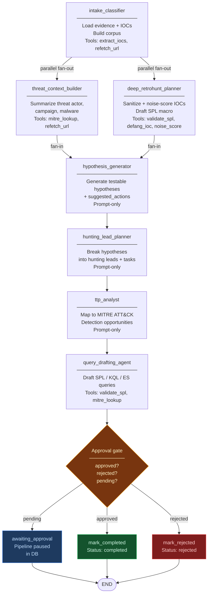
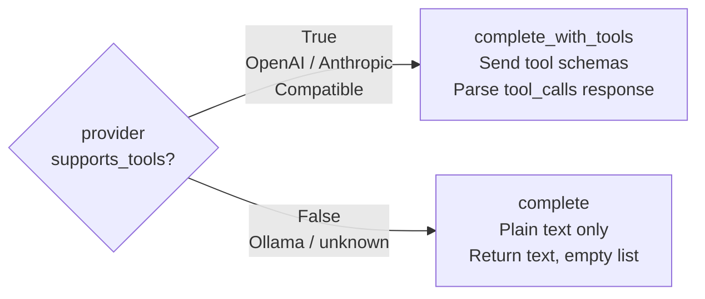
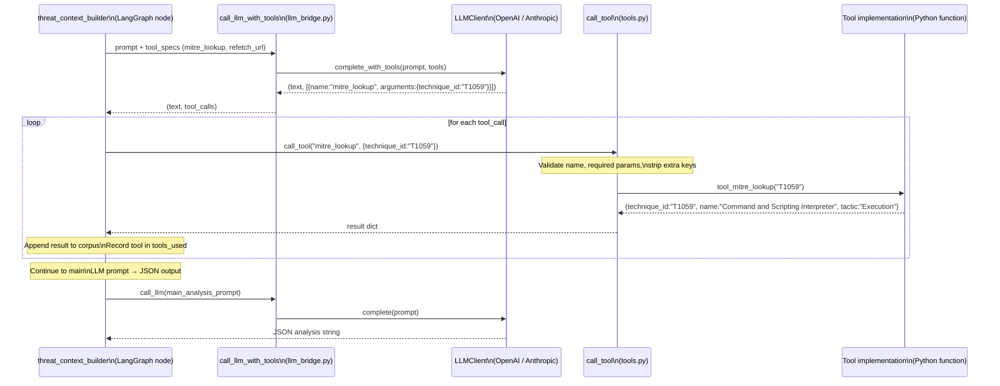

# Agent Architecture — OpenTARS

**Audience:** Engineers and security developers.  
**Status:** Current (reflects issue-local-006)  
**Last updated:** 2026-06-21

---

## Table of Contents

1. [Overview](#1-overview)
2. [LangChain and LangGraph — What Is Used and What Is Deliberately Not](#2-langchain-and-langgraph--what-is-used-and-what-is-deliberately-not)
3. [The Pipeline Graph](#3-the-pipeline-graph)
4. [Tool-Calling Design (issue-006-B)](#4-tool-calling-design-issue-006-b)
   - 4.1 [Provider capability gating](#41-provider-capability-gating)
   - 4.2 [Wire formats: OpenAI vs Anthropic](#42-wire-formats-openai-vs-anthropic)
   - 4.3 [The call_llm_with_tools bridge](#43-the-call_llm_with_tools-bridge)
   - 4.4 [The single-round tool loop](#44-the-single-round-tool-loop)
5. [Tool Catalogue](#5-tool-catalogue)
6. [call_tool Dispatch and Security](#6-call_tool-dispatch-and-security)
7. [Per-Agent Skill Matrix](#7-per-agent-skill-matrix)
8. [What issue-006 Changed in Practice](#8-what-issue-006-changed-in-practice)
9. [State Management](#9-state-management)
10. [Cross-References](#10-cross-references)

---

## 1. Overview

The Threat Hunting pipeline is a **LangGraph stateful directed graph** of seven agent
nodes. Each node is an async Python coroutine that reads from a shared `HuntPipelineState`
TypedDict and writes a partial update back. The graph runs two nodes in parallel
(fan-out), waits for both before continuing (fan-in), and pauses at an **operator
approval gate** before any SIEM execution is permitted.

Issue-006-B added a **bounded tool-calling layer** that allows four of the seven nodes
to ask a capable LLM to invoke a small, closed set of Python functions during their
processing pass. This is the only way the LLM can cause a side-effect (a network
re-fetch); all other actions remain deterministic or confined to structured text
output.

> Related documents:
> - [`platform-overview.md`](platform-overview.md) — non-technical explanation
> - [`threat-hunting-framework-design.md`](threat-hunting-framework-design.md) — full domain-model design
> - [`architecture.md`](architecture.md) — whole-platform module map

---

## 2. LangChain and LangGraph — What Is Used and What Is Deliberately Not

| LangChain / LangGraph piece | Role in this codebase | Notes |
|---|---|---|
| **`langgraph.graph.StateGraph`** | **Primary orchestration engine** — defines the DAG, fan-out edges, approval-gate conditional edge, compiles to a runnable graph. | The piece that actually matters most. |
| **`langchain_core.messages`** (`HumanMessage`, `SystemMessage`) | Optional prompt-assembly helpers in `llm_bridge.py`. Guarded by a `try/except ImportError`. | Not on the critical path; only used to construct `(system, user)` string pairs. |
| **`langchain-openai` / `langchain-anthropic`** | Present as dependencies (required by `langgraph`). | **The chat-model classes (`ChatOpenAI`, etc.) are never instantiated.** HTTP transport is handled entirely by the project's own `LLMClient`. |
| **LangChain `Tool` / `bind_tools` / `ToolNode`** | **Not used.** | Tool-calling is hand-rolled against raw provider APIs (see §4). |
| **LangChain agent runtimes** (`AgentExecutor`, `create_react_agent`, etc.) | **Not used.** | The graph nodes call `call_llm_with_tools()` directly and execute tools in a single round inside the node. |

### Why LangChain's model classes are bypassed

`backend/threat_hunting/agents/llm_bridge.py` explains the rationale directly:

> *"The existing LLMClient already handles: OpenAI, Anthropic, Ollama, OpenAI-compatible
> providers, API-key security (write-only, never logged), Retry / backoff / timeout,
> Structured logging, Reasoning-model output recovery … We do NOT want to re-implement
> all of that via LangChain's own chat model classes (which would need duplicate
> credentials and bypass our security wrappers)."*

The result is a thin async shim: `call_llm()` resolves the provider through the project's
registry, then runs the synchronous `LLMClient.complete()` in a thread pool
(`asyncio.to_thread`) so it is safe to `await` inside LangGraph's async node system.
`call_llm_with_tools()` follows the same pattern, adding the tool-call response path.

---

## 3. The Pipeline Graph

### Live graph topology



### Fan-out / fan-in

`intake_classifier` fans out to both `threat_context_builder` and
`deep_retrohunt_planner` simultaneously via two `add_edge` calls. LangGraph
merges their outputs before `hypothesis_generator` runs because both nodes write
to distinct fields of `HuntPipelineState` (`threat_context` vs `deep_retrohunt`),
and `hypothesis_generator` depends on both. The `Annotated` reducers on list-type
state fields (`step_logs`, `completed_steps`, `errors`) prevent `INVALID_CONCURRENT_GRAPH_UPDATE`
errors during the parallel execution window.

### Approval gate

After `query_drafting_agent`, the `_approval_gate` conditional edge reads
`state["approved"]` and `state["rejected"]`:

- `pending` → `awaiting_approval` node → persists status to DB → `END`.
  The runner exits; no SIEM execution happens. Operator approval via the API
  builds a separate **post-approval graph** (see `pipeline.py:169`) that re-enters
  at `query_drafting_agent` with `approved=True` already in state.
- `approved` → `mark_completed` → `END`.
- `rejected` → `mark_rejected` → `END`.

This is not a LangGraph durable checkpoint interrupt; it is a conditional edge
with state persistence in SQLite. The resume re-fires a new compiled graph
instance with the prior state loaded.

---

## 4. Tool-Calling Design (issue-006-B)

### 4.1 Provider capability gating

`LLMClient` (the abstract base in `backend/llm/client.py`) declares:

```python
@property
def supports_tools(self) -> bool:
    return False  # default

def complete_with_tools(self, prompt, tools, ...) -> tuple[str, list[dict]]:
    # Default: fall back to complete(); return (text, [])
    return self.complete(prompt, ...), []
```

Only `OpenAIClient` and `AnthropicClient` (and `OpenAICompatibleClient` by
inheritance from `OpenAIClient`) override `supports_tools` to return `True`.
`OllamaClient` does not, so Ollama installations transparently degrade to
prompt-only processing — no errors, no configuration required.



### 4.2 Wire formats: OpenAI vs Anthropic

Both formats are normalized to the same internal return type:
`(text: str, tool_calls: list[{name: str, arguments: dict}])`.

**OpenAI / OpenAI-compatible** (`client.py:OpenAIClient.complete_with_tools`):

```json
// Request payload additions
{
  "tools": [
    {
      "type": "function",
      "function": {
        "name": "mitre_lookup",
        "description": "...",
        "parameters": { "type": "object", "properties": { "technique_id": { "type": "string" } }, "required": ["technique_id"] }
      }
    }
  ],
  "tool_choice": "auto"
}

// Response parsing
choices[0].message.tool_calls[].function.{ name, arguments (JSON string) }
```

**Anthropic** (`client.py:AnthropicClient.complete_with_tools`):

```json
// Request payload additions
{
  "tools": [
    {
      "name": "mitre_lookup",
      "description": "...",
      "input_schema": { "type": "object", "properties": { "technique_id": { "type": "string" } }, "required": ["technique_id"] }
    }
  ]
}

// Response parsing
content[].{ type: "tool_use", name, input (dict) }
content[].{ type: "text", text }   ← concatenated into the text return value
```

### 4.3 The `call_llm_with_tools` bridge

`backend/threat_hunting/agents/llm_bridge.py:call_llm_with_tools()` is the single
entry point for nodes that want tool-augmented LLM calls:

```python
async def call_llm_with_tools(
    prompt: str,
    tools: list[dict],          # list of TOOL_SPEC_BY_NAME entries
    *,
    provider_name: str | None,
    model: str | None,
    max_tokens: int = 2048,
    ...
) -> tuple[str, list[dict]]:
    client = get_client(provider_name)

    if not client.supports_tools:
        # Transparent fallback — node receives (text, []) and skips the tool loop
        return await asyncio.to_thread(client.complete, prompt, ...), []

    return await asyncio.to_thread(
        client.complete_with_tools, prompt, tools, ...
    )
```

The `asyncio.to_thread` wrapper runs the synchronous HTTP client on a thread-pool
worker, preserving the async contract of LangGraph nodes.

### 4.4 The single-round tool loop

The tool loop lives **inside the node**, not inside LangGraph or LangChain. Every
tool-enabled node follows this pattern (shown for `threat_context_builder`):



Key properties of this design:

- **Single round** — the model requests tools once; results are fed back by Python;
  the model does not re-request tools. No iterative agent loop.
- **Bounded** — only the 6 registered tools are callable. Unknown names raise
  `ValueError` before any dispatch.
- **Non-blocking** — tool invocations happen between the LLM pre-call and the main
  LLM analysis call. If the tool call fails, `debug_lines` records the error and
  the node continues normally.
- **Results integrated** — each node decides what to do with tool results.
  `intake_classifier` appends refetched text to the corpus; `deep_retrohunt_planner`
  uses `validate_spl` results for awareness only (does not block on them).

---

## 5. Tool Catalogue

All tools live in `backend/threat_hunting/agents/tools.py`. Each tool has an
**OpenAI function-calling JSON schema** in `TOOL_SPECS` and a plain Python
implementation in `_SYNC_TOOLS` or `_ASYNC_TOOLS`.

| Tool | Input schema | Returns | Wraps | Notes |
|---|---|---|---|---|
| `extract_iocs` | `text: str` (≤50 000 chars) | `list[{ioc, ioc_type, ioc_description}]` | `iocs.extract_iocs_from_text()` | Input capped at 50 000 chars |
| `defang_ioc` | `ioc: str` | `str` | `iocs._defang()` | Normalizes defanged notation (e.g. `[.]` → `.`) |
| `noise_score` | `ioc: str`, `ioc_type: str` | `{score: float, reasons: list[str]}` | `iocs._noise_score()` + `deep_retrohunt_planner._noise_reasons()` | Score 0.0–1.0; higher = noisier |
| `mitre_lookup` | `technique_id: str` | `{technique_id, name, tactic}` or `null` | Static 40-entry dict `_MITRE_MAP` | Normalizes `t1059.001` → `T1059.001`; null if not in map |
| `validate_spl` | `query: str` | `{valid: bool, issues: list[str]}` | Pure regex checks | Balanced brackets, double-pipe, recognized command check |
| `refetch_url` | `url: str` | `str` (extracted text) | `url_fetcher.fetch_url()` | **Async.** Full SSRF enforcement via `ssrf.py`; Playwright fallback for JS-heavy pages |

### MITRE technique coverage

`_MITRE_MAP` covers ~40 of the most common ATT&CK techniques. It is a hard-coded
dict in `tools.py` — no network call, no MITRE API dependency. Operators can extend
it by editing the dict without touching the tool interface.

---

## 6. `call_tool` Dispatch and Security

`call_tool(name, arguments)` in `tools.py` is the security chokepoint for all
tool invocations:

```python
async def call_tool(name: str, arguments: dict[str, Any]) -> Any:
    # 1. Reject unknown tool names
    if name not in TOOL_SPEC_BY_NAME:
        raise ValueError(f"Unknown tool: {name!r}")

    spec = TOOL_SPEC_BY_NAME[name]

    # 2. Enforce required parameters
    for req_param in spec["parameters"].get("required", []):
        if req_param not in arguments:
            raise ValueError(f"Tool {name!r} requires parameter {req_param!r}")

    # 3. Strip extra keys the LLM may have hallucinated
    allowed_keys = set(spec["parameters"].get("properties", {}).keys())
    safe_args = {k: v for k, v in arguments.items() if k in allowed_keys}

    # 4. Dispatch to closed set — no eval, no dynamic import, no shell
    if name in _ASYNC_TOOLS:
        return await _ASYNC_TOOLS[name](**safe_args)
    return _SYNC_TOOLS[name](**safe_args)
```

**Security properties:**

| Property | Mechanism |
|---|---|
| No arbitrary code execution | Dispatch map is built at module load from a literal list; no `eval`, no `exec`, no `importlib` with user input |
| No shell execution | No `subprocess`, no `os.system`, no `shlex` |
| SSRF enforcement | `refetch_url` delegates to `url_fetcher.fetch_url()` which calls `ssrf.validate_url()` (DNS-resolved block list including RFC 1918, CGNAT 100.64/10, loopback, link-local, cloud metadata) before any network call |
| Kwarg injection prevention | All keys not in the JSON Schema `properties` are stripped before dispatch; the model cannot pass unknown parameters to reach unexpected code paths |
| Input size cap | `extract_iocs` caps input at 50 000 characters |

---

## 7. Per-Agent Skill Matrix

| Node | Core skill | Tool-enabled | Tools available | Prompt behavior |
|---|---|---|---|---|
| `intake_classifier` | Load evidence + IOCs from DB; build text corpus; emit per-source metadata | **Yes** | `extract_iocs`, `refetch_url` | Triggered only when URL evidence items have thin content (<500 chars). Model decides whether to re-fetch or scan for additional IOCs. Results integrated into corpus before downstream nodes run. |
| `threat_context_builder` | Produce structured threat-actor / campaign / malware / attack-vector context | **Yes** | `mitre_lookup`, `refetch_url` | Pre-enrichment pass: model may look up MITRE IDs it spots in the evidence or re-fetch thin URLs. Enrichment results appended to the evidence corpus passed to the main structured-output prompt. |
| `deep_retrohunt_planner` | Deterministic IOC sanitization + noise scoring + SPL macro draft | **Yes** | `validate_spl`, `defang_ioc`, `noise_score` | Post-draft validation pass: after the main SPL draft is written, model may validate its own query and check IOC noise scores. Results recorded in `debug_lines`; do not block output. |
| `hypothesis_generator` | Generate testable hunting hypotheses each with `suggested_actions` | No | — | Structured-output prompt only. Returns JSON array of `Hypothesis` objects including 2–4 concrete detection actions per hypothesis. |
| `hunting_lead_planner` | Convert hypotheses into concrete hunting leads with sub-tasks | No | — | Structured-output prompt only. |
| `ttp_analyst` | Map evidence to MITRE ATT&CK techniques + detection opportunities | No | — | Structured-output prompt only. |
| `query_drafting_agent` | Draft SPL / KQL / ES DSL SIEM queries | **Yes** | `validate_spl`, `mitre_lookup` | Post-draft validation pass: model validates the SPL queries it just wrote and confirms MITRE technique references. |
| `report_writer` | Assemble executive summary + full structured report (JSON / Markdown / PDF) | — | — | **Not a LangGraph node.** Standalone async function called from the execution runner after SIEM results are available. Also callable via `POST /api/threat-hunting/packages/{id}/report`. |

### Why three nodes are prompt-only

`hypothesis_generator`, `hunting_lead_planner`, and `ttp_analyst` are "judgement"
nodes — they produce structured analysis that is the primary deliverable of each
step, and their output format is dense JSON. Offering tools to them would risk the
model spending tokens on tool invocations instead of producing the required output.
The four "data-processing" nodes (`intake_classifier`, `threat_context_builder`,
`deep_retrohunt_planner`, `query_drafting_agent`) have clear, bounded reasons to
call tools (fetch richer data, validate outputs), making the cost/benefit favorable.

---

## 8. What issue-006 Changed in Practice

### Before issue-006

Every node followed a single fixed pattern:

```
build_prompt(evidence) → call_llm(prompt) → parse_json(response) → write state
```

The LLM was a pure text generator. It had no way to act on incomplete evidence —
if a URL evidence item had only 50 characters of extracted text because the source
was JavaScript-rendered, the model simply worked with 50 characters.

### After issue-006

Four nodes gained an **optional pre-pass** (or post-pass for validation):

```
[optional: call_llm_with_tools → execute tools → integrate results]
   ↓
build_prompt(enriched_evidence) → call_llm(prompt) → parse_json → write state
```

**Concrete behavioral changes:**

| Before | After |
|---|---|
| `intake_classifier`: corpus built from whatever text was extracted | Model may ask to re-fetch thin URL evidence via Playwright-backed fetcher and add the richer text to corpus |
| `threat_context_builder`: works only with pre-loaded evidence | Model may resolve MITRE technique IDs it identifies in the evidence; enrichment text prepended to the analysis context |
| `deep_retrohunt_planner`: SPL draft written without self-validation | Model may call `validate_spl` on its own draft and `noise_score` on specific IOCs; issues recorded in `debug_lines` |
| `query_drafting_agent`: queries written, no self-check | Model may validate each SPL query and confirm MITRE references before returning the draft set |
| Step logs: `{step, status, elapsed_s, item_count}` | Step logs now include `tools_used: list[str]`, `decision: str`, `debug_lines: list[str]` |
| Workflow visualizer: step cards with timing | Step cards now show purple `tool_name()` pills and a decision sub-text per step |

### What did NOT change

- The graph topology, approval gate, and state persistence are unchanged.
- The three judgement nodes (`hypothesis_generator`, `hunting_lead_planner`,
  `ttp_analyst`) are unchanged — prompt-only, no tools.
- `report_writer` is unchanged — it remains a standalone async function, not a
  LangGraph node.
- Ollama users see no difference: the capability gate returns an empty tool-calls
  list and the node proceeds as before.

---

## 9. State Management

The pipeline state is a `TypedDict` defined in
`backend/threat_hunting/agents/state.py`. Fields that can be written concurrently
by parallel nodes use `Annotated` merge reducers:

```python
class HuntPipelineState(TypedDict):
    # Identity
    hunt_package_id: str
    provider_name: str | None
    model_name: str | None
    research_effort: str           # high | medium | low

    # Pipeline control
    approved: bool
    rejected: bool
    approval_notes: str
    generation_status: str
    current_step: str
    completed_steps: Annotated[list[str], operator.add]   # merged by LangGraph
    step_logs: Annotated[list[dict], operator.add]        # merged by LangGraph
    errors: Annotated[list[str], operator.add]            # merged by LangGraph

    # Agent outputs
    evidence_text_corpus: str
    ioc_summary: dict
    raw_ioc_list: list[dict]
    threat_context: dict | None
    hypotheses: list[Hypothesis]
    hunting_leads: list[HuntingLead]
    deep_retrohunt: DeepRetrohuntLead | None
    ttp_analysis: BehavioralTTPAnalysis | None
    query_drafts: list[QueryDraft]
```

After every node, the runner persists the full state to `hunting_packages` in
`data/threat_hunting.db`. This means the pipeline is durable across process
restarts for the `awaiting_approval` pause point.

### Step logs schema

Each entry written to `step_logs` by a node:

```python
{
    "step": "threat_context_builder",
    "status": "ok",          # ok | error | partial | skipped
    "elapsed_s": 3.42,
    "item_count": 4,         # node-specific; hypotheses count, query count, etc.
    "ioc_count": 23,         # deep_retrohunt_planner only
    "noisy_count": 5,        # deep_retrohunt_planner only
    "effort": "medium",      # effort-profile nodes
    "tools_used": ["mitre_lookup"],   # issue-006: tools actually called
    "decision": "Found T1059...",     # issue-006: model's brief rationale
    "debug_lines": ["TOOL_CALL: ...", "TOOL_RESULT: ..."],  # issue-006
    "intake_sources": [...]  # intake_classifier only (issue-006-C)
}
```

---

## 10. Cross-References

| Document | Contents |
|---|---|
| [`platform-overview.md`](platform-overview.md) | Non-technical explanation of the whole platform; plain-language agent descriptions; Mermaid capability diagram |
| [`threat-hunting-framework-design.md`](threat-hunting-framework-design.md) | Full domain model: Hunt Package schema, evidence model, IOC model, SSRF policy, DB schema, role model, API route map, implementation notes |
| [`architecture.md`](architecture.md) | Whole-platform module map (backend + frontend), data-flow diagrams, config files, dependencies |
