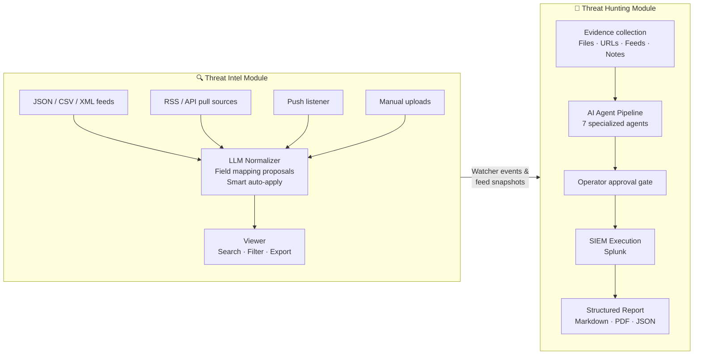

# OpenTARS — Platform Overview

**Audience:** Security managers, SOC leads, non-technical stakeholders.  
**Last updated:** 2026-07-29

---

## What Is OpenTARS?

OpenTARS is a **security operations workbench** that helps threat hunting
analysts do more in less time. It collects threat intelligence from many sources,
uses an AI assistant to turn that intelligence into a structured hunting plan, and
lets analysts execute that plan directly against their SIEM — all from a single
web interface running entirely on your own infrastructure.

Think of it as giving your threat hunting team a **tireless research assistant**
that reads every threat report, extracts the important indicators, builds a
structured investigation plan, and drafts the search queries — while keeping a
human analyst in control of every decision before anything touches your live
environment.

---

## The Problem It Solves

Threat hunting analysts routinely face:

- **Intelligence overload.** Dozens of threat reports, advisories, and feeds arrive
  every week. Reading, extracting indicators, and cross-referencing them manually
  takes hours.
- **The blank-page problem.** Translating a threat report into a concrete SIEM
  search strategy requires deep expertise, and the same thinking has to be
  repeated for each new piece of intelligence.
- **Query fatigue.** Writing, checking, and tuning SPL queries is tedious work
  that pulls analysts away from higher-value judgment tasks.
- **Documentation gap.** After a hunt, reconstructing what was done and why is
  painful and often incomplete.

OpenTARS automates the repetitive, research-heavy parts while preserving
the judgment that only a human analyst can provide.

---

## The Two Halves of the Platform



| Module | What it does |
|---|---|
| **Threat Intel** | Continuously ingests and normalizes threat feeds. An LLM suggests field-mapping improvements that an operator can review, approve, or auto-apply. The Viewer lets analysts search, filter, and export normalized indicators. |
| **Threat Hunting** | Takes a piece of threat intelligence, processes it through a team of AI agents to produce a hunting plan, asks a human to approve the plan, then executes it against your SIEM and generates a report. |

The two modules are connected: the Threat Hunting module can pull events directly
from Threat Intel watchers as evidence for a hunt.

---

## The Big Picture: How a Hunt Works End to End

```mermaid
flowchart TD
    classDef input fill:#1e3a5f,stroke:#3b82f6,color:#bfdbfe
    classDef agent fill:#1f2937,stroke:#6366f1,color:#a5b4fc
    classDef gate fill:#78350f,stroke:#f59e0b,color:#fef3c7
    classDef exec fill:#14532d,stroke:#22c55e,color:#d1fae5
    classDef output fill:#4a1d96,stroke:#8b5cf6,color:#ddd6fe
    classDef human fill:#7c2d12,stroke:#f97316,color:#fed7aa

    %% ── Evidence intake ─────────────────────────────────────────────────────
    subgraph INTAKE["📥 Step 1 · Collect Evidence"]
        PDF[PDF / DOCX / TXT files]
        URL[URLs — web pages,\nblog posts, advisories]
        FEED[Threat Intel\nwatcher events]
        NOTE[Manual notes\npasted threat intel]
    end

    %% ── Automated analysis ───────────────────────────────────────────────────
    subgraph AGENTS["🤖 Step 2 · AI Agent Analysis  (automated, ~2–5 min)"]
        direction TB
        A1["📋 Intake Classifier\nExtracts IOCs · Builds evidence corpus\nRe-fetches thin URLs when needed"]
        A2["🧠 Threat Context Builder\nWho is the attacker?\nWhat campaign / malware?"]
        A3["🔬 Deep Retrohunt Planner\nSanitizes + noise-scores IOCs\nDrafts Splunk search macro"]
        A4["💡 Hypothesis Generator\nWhat might the attacker\nhave done in your environment?"]
        A5["🗺️ Hunting Lead Planner\nBreaks each hypothesis into\nconcrete investigation tasks"]
        A6["🏷️ TTP Analyst\nMaps behaviour to MITRE\nATT&CK techniques"]
        A7["📝 Query Drafting Agent\nWrites SPL · KQL · Elastic\nqueries for each lead"]

        A1 --> A2
        A1 --> A3
        A2 --> A4
        A3 --> A4
        A4 --> A5
        A5 --> A6
        A6 --> A7
    end

    %% ── Human gate ───────────────────────────────────────────────────────────
    subgraph GATE["🧑‍💼 Step 3 · Human Approval  (nothing runs without this)"]
        direction TB
        REVIEW["Analyst reviews:\n• Threat context summary\n• Hypotheses + suggested actions\n• IOC list with noise flags\n• MITRE technique mapping\n• Draft SIEM queries"]
        DEC{Approve or\nRevise / Reject?}
        REVIEW --> DEC
    end

    %% ── Execution ────────────────────────────────────────────────────────────
    subgraph EXEC["⚡ Step 4 · SIEM Execution  (approved packages only)"]
        direction TB
        SPL["SPL query sent\nto Splunk REST API"]
        POLL["Results collected\nEvents matched"]
        INTERP["AI interprets\nfindings in plain language"]
        SPL --> POLL --> INTERP
    end

    %% ── Report ───────────────────────────────────────────────────────────────
    subgraph REPORT["📊 Step 5 · Report"]
        direction TB
        EXEC_SUM["Executive summary\n(AI-generated, human-readable)"]
        FULL["Full structured report:\n• Evidence summary\n• Threat context\n• Hypotheses + actions\n• Hunt leads + tasks\n• TTP analysis\n• Execution results\n• Recommendations"]
        EXPORT["Export: Markdown · PDF · JSON"]
        EXEC_SUM & FULL --> EXPORT
    end

    %% ── Connections ──────────────────────────────────────────────────────────
    INTAKE --> AGENTS
    AGENTS --> GATE
    DEC -->|"✅ Approved"| EXEC
    DEC -->|"❌ Rejected\nBack to review"| AGENTS
    EXEC --> REPORT

    %% ── Styles ───────────────────────────────────────────────────────────────
    class PDF,URL,FEED,NOTE input
    class A1,A2,A3,A4,A5,A6,A7 agent
    class REVIEW,DEC gate
    class SPL,POLL,INTERP exec
    class EXEC_SUM,FULL,EXPORT output
```



---

## Meet the AI Agent Team

The pipeline uses **seven specialized AI agents** working in sequence (with two
running in parallel during the analysis phase). Each agent has a single,
well-defined job:

| Agent | Plain-language role |
|---|---|
| **Intake Classifier** | Reads all the evidence files and URLs, extracts indicators of compromise (IP addresses, domains, file hashes, CVEs), and organizes everything into a structured corpus. If a web page was too dynamic to extract earlier, it can re-fetch it using a headless browser. |
| **Threat Context Builder** | Synthesizes the evidence into a portrait of the threat: who the attacker likely is, what campaign or malware family is involved, what attack method was used, and how confident we are. It can look up MITRE ATT&CK technique details as it works. |
| **Deep Retrohunt Planner** | Focuses purely on the raw indicators: cleans them up, scores each one for how likely it is to produce false positives in your SIEM, and drafts a Splunk search macro covering all viable indicators. Runs in parallel with the context builder to save time. |
| **Hypothesis Generator** | Asks: "Given this attacker and these indicators, what might they have done in our environment?" Produces 3–6 testable hypotheses, each with concrete detection suggestions. |
| **Hunting Lead Planner** | Breaks each hypothesis into a concrete hunting lead with specific investigation tasks. This becomes the structured work plan for the hunt. |
| **TTP Analyst** | Maps the observed behaviour to the MITRE ATT&CK framework — identifying which adversary techniques apply and what detection opportunities they create. |
| **Query Drafting Agent** | Writes the actual SIEM queries (Splunk SPL, Microsoft Sentinel KQL, Elastic DSL) for each hunting lead. It validates the syntax of its own Splunk queries before finishing. |

---

## The Human Approval Gate — Why It Matters

**Nothing runs against your live SIEM without a human saying yes.**

After the seven agents finish their analysis, the entire draft — threat context,
hypotheses, IOC list, queries — is presented to the analyst for review. The
analyst can:

- **Approve** — the plan proceeds to SIEM execution as-is.
- **Revise** — add notes and approve with modifications.
- **Reject** — discard the run; start a new one with different evidence or settings.

This gate is enforced at the infrastructure level, not just in the UI. The SIEM
connector will not receive any query until the database records an explicit approval.

---

## Ask OpenTARS a Question

Beyond the hunting pipeline, a second, smaller AI capability sits behind a search
icon on every page: **global search** and **the Assistant**. Global search finds
hunt packages, threat intel, watchers, and settings by keyword, instantly. The
Assistant goes further — ask it a plain-English question ("what CVEs have we seen
across our hunts?", "which threat actors are we tracking?") and it answers from
whatever you already have access to, with the sources it used cited alongside the
answer. Conversations are saved automatically as named sessions you can revisit,
rename, or export.

The guardrail is structural, not just a prompt instruction: the Assistant only
ever retrieves and summarizes data the asking user's own role could already
reach — the same lookup the search box itself uses — and it has no ability to
create, change, or execute anything. Answering a question and running a hunt are
two different, separately-gated capabilities.

A **Dashboard** (the Threat Hunting module's default view) and a **Data
Explorer** (the row-level data behind every Dashboard number, one click away)
round out the day-to-day picture: hunt/run counts, activity over time, IOC and
evidence breakdowns, and the threat actors/campaigns/malware families/MITRE
techniques identified across every hunt, all in one place.

---

## What the AI Can and Cannot Do

Understanding the boundaries keeps the platform trustworthy.

| The AI **can** do this | The AI **cannot** do this |
|---|---|
| Read and analyze evidence you provide | Access any system except your configured SIEM (and only after approval) |
| Suggest what to look for in your SIEM | Execute searches, make changes, or take actions autonomously |
| Draft SIEM queries for human review | Write queries that run without human sign-off |
| Re-fetch a public URL to gather more context | Reach internal or private IP addresses (SSRF protection blocks this) |
| Produce a structured report | Automatically share or publish findings anywhere |
| Flag potentially noisy IOCs before execution | Override operator judgment on noisy-IOC decisions |

The AI generates **drafts and recommendations only**. Every action that affects
live infrastructure requires a human decision.

---

## Roles: Who Can Do What

| Role | Capabilities |
|---|---|
| **Admin** | Full access: configuration, user management, all Threat Intel and Threat Hunting operations |
| **Threat Researcher** | Full Threat Hunting access: create, run, approve, and execute hunts. Read-only Threat Intel Viewer. No platform configuration. |
| **Threat Viewer** | Read-only access to hunt packages and reports. Read-only Threat Intel Viewer. |
| **Feed Sender** | Machine account for pushing threat intel feeds via API. No UI access. |

---

## Deployment and Infrastructure

OpenTARS is designed to run **entirely on your own infrastructure**:

- No external cloud service required.
- All data stored locally in SQLite databases under `data/`.
- LLM calls go to whichever provider you configure (OpenAI API, Anthropic API,
  a local Ollama instance, or any OpenAI-compatible endpoint).
- The `./opentars` launcher installs all dependencies automatically on
  first run — no separate setup step.
- Docker support available via `docker/`.

```
Your machine / server
┌────────────────────────────────────────────────┐
│  ./opentars start                              │
│                                                │
│  ┌──────────────┐    ┌──────────────────────┐  │
│  │  Backend     │    │  Frontend            │  │
│  │  (Python /   │◄──►│  (React web app)     │  │
│  │  FastAPI)    │    │  served by backend   │  │
│  └──────┬───────┘    └──────────────────────┘  │
│         │                                      │
│  ┌──────▼───────┐                              │
│  │  data/*.db   │  ← all data stays here       │
│  │  (SQLite)    │                              │
│  └──────────────┘                              │
└────────────────────────────────────────────────┘
         │                      │
         ▼                      ▼
  Your LLM provider       Your Splunk instance
  (OpenAI / Anthropic /   (via REST API, after
   Ollama / compatible)    operator approval)
```

---

## Where to Go Deeper

| Document | For whom |
|---|---|
| [`agent-architecture.md`](agent-architecture.md) | Engineers: exact LangGraph/LangChain usage, tool-calling wire formats, per-agent skill matrix, security properties |
| [`threat-hunting-framework-design.md`](threat-hunting-framework-design.md) | Engineers: full domain model, DB schema, evidence model, IOC model, SSRF policy, API route map |
| [`architecture.md`](architecture.md) | Engineers: whole-platform module map, config files, dependencies, data flows |
| [`../README.md`](../README.md) | Quick start, prerequisites, startup commands |
